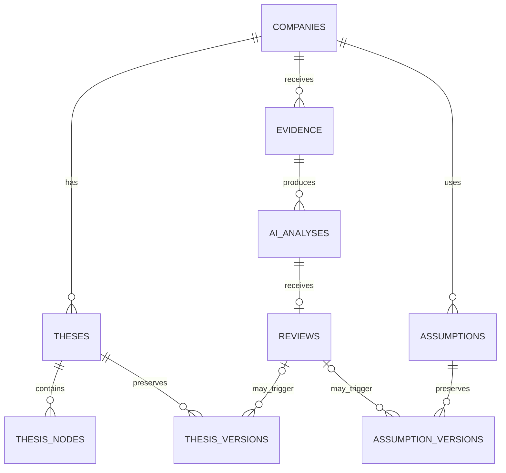

# Design Package: Minimal Database Schema v0.1

**Purpose:** A small relational model derived from the frozen workflow. It stores personal research, evidence provenance, review decisions, and history; it is not a general financial-data warehouse.

## 1. Design principles

- Persist only the data needed to replay the user's research reasoning.
- Store external sync output as an evidence snapshot, with provenance and timestamps.
- Keep AI output separate from human-approved decisions.
- Preserve historical changes; do not silently overwrite material reasoning or assumptions.
- Use `JSONB` only for provider-specific sync payloads and structured AI drafts. This avoids creating financial-statement tables before the MVP proves it needs them.

## 2. Entity relationship overview



## 3. Minimal tables

### 3.1 `companies`

| Column | Type | Notes |
|---|---|---|
| `id` | UUID PK | Internal identifier. |
| `ticker` | VARCHAR(20) UNIQUE | Stored uppercase after validation. |
| `name` | VARCHAR(200) | User-facing company name. |
| `created_at` | TIMESTAMPTZ | Creation time. |
| `updated_at` | TIMESTAMPTZ | Last working-record update. |

### 3.2 `theses`

One active thesis container per company is sufficient for the prototype.

| Column | Type | Notes |
|---|---|---|
| `id` | UUID PK | |
| `company_id` | UUID FK → `companies.id` | |
| `title` | VARCHAR(200) | E.g. “Base thesis”. |
| `current_summary` | TEXT | Current user-owned working thesis. |
| `status` | VARCHAR(20) | `active` or `archived`. |
| `created_at`, `updated_at` | TIMESTAMPTZ | |

Constraint: one active thesis per company.

### 3.3 `thesis_nodes`

| Column | Type | Notes |
|---|---|---|
| `id` | UUID PK | |
| `thesis_id` | UUID FK → `theses.id` | |
| `parent_id` | UUID nullable FK → `thesis_nodes.id` | Supports an optional Sub-thesis hierarchy. |
| `node_type` | VARCHAR(20) | `driver`, `risk`, `kpi`, or `sub_thesis`. |
| `title` | VARCHAR(200) | |
| `description` | TEXT | Nullable. |
| `importance` | VARCHAR(10) | `low`, `medium`, or `high`. |
| `status` | VARCHAR(20) | `active` or `archived`. |
| `created_at`, `updated_at` | TIMESTAMPTZ | |

### 3.4 `evidence`

Manual evidence and on-demand sync attempts use one table. This prevents two parallel provenance models.

| Column | Type | Notes |
|---|---|---|
| `id` | UUID PK | |
| `company_id` | UUID FK → `companies.id` | |
| `entry_mode` | VARCHAR(10) | `manual` or `sync`. |
| `evidence_type` | VARCHAR(40) | E.g. `earnings`, `historical_price`. |
| `title` | VARCHAR(300) | Required for manual entry; generated for sync. |
| `content` | TEXT nullable | Manual text or a normalized readable summary. |
| `source_name` | VARCHAR(200) nullable | News source or provider display name. |
| `source_url` | TEXT nullable | Required for manual entry in MVP. |
| `provider` | VARCHAR(100) nullable | Required for sync results when known. |
| `event_date` | DATE nullable | Occurrence/publication date. |
| `retrieved_at` | TIMESTAMPTZ nullable | Required for sync attempt. |
| `query_parameters` | JSONB nullable | Sanitized request information; no credentials. |
| `raw_payload` | JSONB nullable | Provider response needed to reproduce display/analysis. |
| `status` | VARCHAR(20) | `pending`, `saved`, `partial`, or `failed`. |
| `error_code`, `error_message` | TEXT nullable | Failure context without secrets. |
| `created_at` | TIMESTAMPTZ | |

Rules:

- Manual entry: `entry_mode = manual`, `title`, `content`, `source_url`, and `event_date` are required; it is saved directly with `status = saved`.
- Sync entry: create the row before the provider call with `status = pending`; update it to `saved`, `partial`, or `failed`. It retains its own row on every attempt.
- `raw_payload` is an evidence snapshot. It is not refreshed in place.

### 3.5 `ai_analyses`

| Column | Type | Notes |
|---|---|---|
| `id` | UUID PK | |
| `evidence_id` | UUID FK → `evidence.id` | |
| `thesis_id` | UUID FK → `theses.id` | Thesis context used. |
| `status` | VARCHAR(20) | `draft`, `failed`, or `superseded`. |
| `structured_result` | JSONB nullable | Summary, impact mappings, confidence, limitations. |
| `raw_response` | JSONB/TEXT nullable | Auditable model response. |
| `model` | VARCHAR(100) nullable | Model identifier. |
| `prompt_version` | VARCHAR(50) nullable | Prompt traceability. |
| `error_message` | TEXT nullable | |
| `created_at` | TIMESTAMPTZ | |

The initial schema deliberately stores impact mappings inside `structured_result`. Split them into a dedicated table only when queries across many analyses become a real need.

### 3.6 `reviews`

| Column | Type | Notes |
|---|---|---|
| `id` | UUID PK | |
| `analysis_id` | UUID UNIQUE FK → `ai_analyses.id` | One final review per draft in MVP. |
| `decision` | VARCHAR(20) | `accept`, `edit_and_accept`, or `reject`. |
| `final_result` | JSONB nullable | Accepted original or user-edited structured result. |
| `reviewer_note` | TEXT nullable | |
| `reviewed_at` | TIMESTAMPTZ | |

### 3.7 `thesis_versions`

| Column | Type | Notes |
|---|---|---|
| `id` | UUID PK | |
| `thesis_id` | UUID FK → `theses.id` | |
| `version_number` | INTEGER | Unique within a thesis. |
| `summary_snapshot` | TEXT | Approved thesis text at that time. |
| `nodes_snapshot` | JSONB | Small snapshot of relevant nodes. |
| `change_reason` | TEXT | User-approved explanation. |
| `trigger_evidence_id` | UUID nullable FK → `evidence.id` | Evidence link when applicable. |
| `review_id` | UUID nullable FK → `reviews.id` | Review link when applicable. |
| `created_at` | TIMESTAMPTZ | |

### 3.8 `assumptions`

Stores the current working value for a small, user-controlled valuation input.

| Column | Type | Notes |
|---|---|---|
| `id` | UUID PK | |
| `company_id` | UUID FK → `companies.id` | |
| `metric` | VARCHAR(50) | Initial values: `eps` or `pe_multiple`. |
| `period` | VARCHAR(20) | E.g. `2028`; may be blank for P/E. |
| `value` | NUMERIC(18,6) | User-entered value. |
| `unit` | VARCHAR(20) | E.g. `USD`, `multiple`. |
| `updated_at` | TIMESTAMPTZ | |

Constraint: unique `(company_id, metric, period)`.

### 3.9 `assumption_versions`

| Column | Type | Notes |
|---|---|---|
| `id` | UUID PK | |
| `assumption_id` | UUID FK → `assumptions.id` | |
| `old_value` | NUMERIC(18,6) nullable | Null on initial creation. |
| `new_value` | NUMERIC(18,6) | |
| `reason` | TEXT | Required for a changed value. |
| `review_id` | UUID nullable FK → `reviews.id` | Optional link. |
| `created_at` | TIMESTAMPTZ | |

Fair value is calculated from current assumptions in application code (`EPS × P/E`) and does not need a table until a saved calculation history is demonstrably needed.

## 4. Essential constraints and indexes

The future migration should include at least:

```text
UNIQUE companies(ticker)
UNIQUE thesis_versions(thesis_id, version_number)
UNIQUE reviews(analysis_id)
UNIQUE assumptions(company_id, metric, period)

INDEX evidence(company_id, created_at DESC)
INDEX evidence(company_id, status, retrieved_at DESC)
INDEX ai_analyses(evidence_id, created_at DESC)
INDEX thesis_nodes(thesis_id, status)
INDEX thesis_versions(thesis_id, created_at DESC)
```

Use database `CHECK` constraints or enum types for the small status/type sets named above. Keep error messages and raw sync payloads free of API keys and authorization headers.

## 5. Vertical-slice subset

Only the following objects are required to deliver `ticker → Sync → evidence snapshot → display`:

```text
companies
evidence
```

`theses` and `thesis_nodes` may be added to let the user select company context, but AI analyses, reviews, version tables, and assumptions are not required for that first executable proof. This intentionally keeps the first implementation small while ensuring it can grow into the frozen workflow without a redesign.
